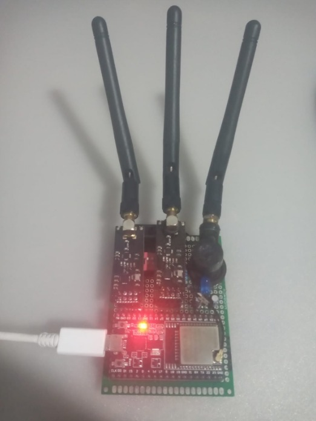

<h1 align="center"> ⚡ BIT-KILLER : SYSTEM OVERRIDE </h1>

> **Developed by STARLUX**

<div align="center">

<div align="center">
  
  <p><i>Unidad Central BIT-KILLER: ESP32-U + Dual nRF24L01+PA+LNA</i></p>
</div>

```text
 +-------------------------------------------------------+
 |  ____  ___ _____   _  _____ _     _     _____ ____    |
 | | __ )|_ _|_   _| | |/ /_ _| |   | |   | ____|  _ \   |
 | |  _ \ | |  | |   | ' / | || |   | |   |  _| | |_) |  |
 | | |_) || |  | |   | . \ | || |___| |___| |___|  _ <   |
 | |____/|___| |_|   |_|\_\___|_____|_____|_____|_| \_\\ |
 |                                                       |
 |            S Y S T E M    B Y    S T A R L U X        |
 +-------------------------------------------------------+
```

 <div align="left">
  
## > 📟 Descripción

BIT-KILLER es un sistema de auditoría de radiofrecuencia para el espectro de 2.4GHz. Utiliza un ESP32 (NodeMCU-32S)
con doble bus SPI para controlar dos módulos nRF24L01+PA+LNA de forma independiente.


## > 🛡️ Power Sentinel (Prevención de Energía)

El sistema incluye un algoritmo de monitoreo de hardware. Si detecta una caída de tensión por debajo de los niveles críticos
en los módulos de radio, la interfaz mostrará una alerta dinámica:

ADVERTENCIA: Tensión insuficiente detectada.

ACCIÓN: Desconectar un módulo físicamente para operar a máxima potencia con el restante.


## > 🚀 Modos de Ataque:

MODO BLE: Interferencia dirigida a protocolos Bluetooth (Bafles/Auriculares).

MODO WIFI: Saturación de canales de red inalámbrica.

PANICO: Ejecución simultánea en ambos módulos para saturación total del espectro.


## > 🔌 Hardware & Pinout (Diagrama de Conexiones)

Para lograr la máxima capacidad del BIT-KILLER, se requiere la conexión de ambos módulos nRF24L01 en buses independientes. A continuación, el esquema de cableado por líneas:

## NRF24 A: HSPI (Especial para WiFi)

<div align="center">
  
| Componente | Pin nRF24 | Pin ESP32 (GPIO) | Función |
| :--- | :--- | :--- | :--- |
| **Radio A** | VCC | 3.3V | Alimentación |
| **WiFi** | GND | GND | Tierra |
| | CE | GPIO 16 | Chip Enable |
| | CSN | GPIO 15 | Chip Select |
| | SCK | GPIO 14 | Clock |
| | MOSI | GPIO 13 | Master Out |

</div>

## NRF24 B: VSPI (Especial para Bluetooth/BLE)

<div align="center">

| Componente | Pin nRF24 | Pin ESP32 (GPIO) | Función |
| :--- | :--- | :--- | :--- |
| **Radio B** | VCC | 3.3V | Alimentación |
| **BLE/BT** | GND | GND | Tierra |
| | CE | GPIO 22 | Chip Enable |
| | CSN | GPIO 21 | Chip Select |
| | SCK | GPIO 18 | Clock |
| | MOSI | GPIO 23 | Master Out |

</div>

## LED Indicador

<div align="center">
  
|  ESP32 |    4.7k Ohm       | 3mm ESTADO LED (blue)|
|--------|-------------------|----------------------|
|   GND  |                   |       (-) LED        |
|        |    Resistencia    |       (+) LED        |
| GPIO27 |    RESISTENCIA    |                      |

</div>

## > 🛠️ Lista de comprobación

ESP32 Dev Module: (Recomendado: 38 pines para acceso total a GPIO).

2x nRF24L01+PA+LNA: Con antena externa para un rango de 30m+.

Alimentación: Cable USB de datos de alta calidad (Crítico para evitar caídas de tensión).

Capacitores (Opcional): 10uF a 100uF soldados directamente entre VCC y GND de los módulos de radio para estabilizar el Power Sentinel.


## >  🕹️ Control del Sistema

El dispositivo opera de forma inmediata tras el encendido. El control se realiza mediante el botón físico del ESP32:

Botón BOOT (GPIO 0): Presión corta para ciclar entre los modos (BLE -> WIFI -> SIGILO -> PANICO).

Reset de Emergencia: Mantener presionado 3 segundos para volver al modo REPOSO.

Indicador LED (GPIO 27): El parpadeo indica la agresividad del modo seleccionado.


## > 📡 Canales de Operación

Bluetooth (Clásico): 79 canales (2,402 GHz - 2,480 GHz).

BLE: 40 canales (2,400 GHz - 2,4835 GHz).

WiFi: 14 Canales (Saturación de banda ancha 2.4GHz).


# ⚠️ Disclaimer: Este software es estrictamente para fines educativos y pruebas de penetración autorizadas.

-----------------------------------------------------------------------------------------------------------------------------------
